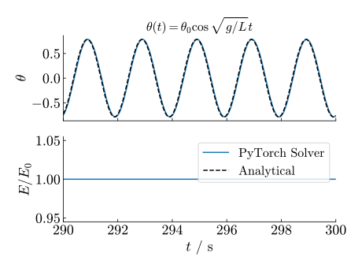
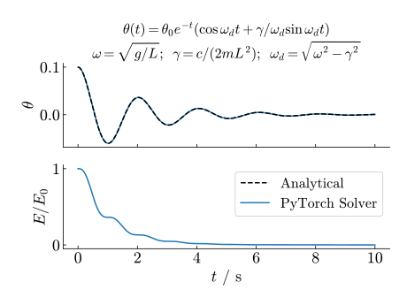

# Automatic Lagrangian Mechanics using PyTorch
Lagrangian mechanics provides a mathematically beautiful and conceptually elegant framework for describing the dynamics of physical systems. Instead of focusing on forces as in Newtonian mechanics, it captures motion through a energy function. This formulation simplifies the treatment of complex systems with constraints which are traditionally hard to model using Newtonian mechanics.

By simply defining the energy of the system in terms of arbitrary generalized coordinates we can automatically simulate the dynamics of the system using PyTorch. It is almost like magic.

> ~ Classical Mechanics, Taylor 2003: Some purists object that the Lagrangian approach makes life too easy, removing the need to think about the physics.

I will give a brief interlude which is rather mathematical, feel free to skip it and check the examples. You'll find the implementation on my [GitHub](http://github.com/jelle-westra/lagrangian).

## Background
Often due to symmetries or constraints it is often easier to describe a physical system's energy function in terms of generalized coordinates in comparison to a Newtonian force framework. For example a rollercoaster car, contrained to the rails. The Lagrangian $\mathcal{L}$ in terms of generalized coordinate $\mathbf{q}(t)$ is defined as:

$$
\mathcal{L}(\mathbf{q}, \dot{\mathbf{q}}) = T - V
$$

where $T$ is the kinetic energy and $V$ is the potential energy. [Hamilton's principle of least action](https://en.wikipedia.org/wiki/Hamilton%27s_principle) leads to the Euler-Lagrange equations:

$$
\frac{d}{dt}\nabla_{\dot{\mathbf{q}}}\mathcal{L} = \nabla_\mathbf{q}\mathcal{L}
$$

Equations of motion for the generalized coordinates can be derived using this relation. Thanks to the maturity of autograd tools like PyTorch we can automatically calculate numerically the generalized acceleration $\ddot{\mathbf{q}}.$

In the paper [Lagrangian Neural Networks](https://arxiv.org/abs/2003.04630), authors derive using the chain rule on the lhs:

$$
(\nabla_{\dot{\mathbf{q}}}\nabla_{\dot{\mathbf{q}}}^\intercal\mathcal{L})\ddot{\mathbf{q}} + 
(\nabla_{\mathbf{q}}\nabla_{\dot{\mathbf{q}}}^\intercal\mathcal{L})\dot{\mathbf{q}} =
\nabla_{\mathbf{q}}\mathcal{L}.
$$

Note, 

$$
(\nabla_{\dot{\mathbf{q}}}\nabla_{\dot{\mathbf{q}}}^\intercal\mathcal{L})_{ij} = \frac{\partial^2\mathcal{L}}{\partial\dot{q}_j\partial\dot{q}_i}
\qquad\text{and}\qquad
(\nabla_{{\mathbf{q}}}\nabla_{\dot{\mathbf{q}}}^\intercal\mathcal{L})_{ij} = \frac{\partial^2\mathcal{L}}{\partial{q}_j\partial\dot{q}_i}
$$

are the lower-right and the lower-left quadrant of the Hessian of $\mathcal{L}$ respectively; we have a linear system of equations which can be solved by:

$$
\ddot{\mathbf{q}} = 
(\nabla_{\dot{\mathbf{q}}}\nabla_{\dot{\mathbf{q}}}^\intercal\mathcal{L})^{-1}
[
    \nabla_\mathbf{q}\mathcal{L} - 
    (\nabla_{\mathbf{q}}\nabla_{\dot{\mathbf{q}}}^\intercal\mathcal{L})\dot{\mathbf{q}}
].
$$

Inspired by a post by [Magnus Ross](https://magnusross.github.io/posts/l1/), this can be implemented in PyTorch as:

```
u = torch.tensor([t, *q, *qdot], requires_grad=True, dtype=torch.float64)
        
H = hessian(self.lagrangian, u)

# J_L = dL/dq
J_L = jacobian(self.lagrangian, u)[1:self.n+1]

# J_Q = dQ/dq_dot (dissipative forces)
J_Q = jacobian(self.Q, u)[self.n+1:]

# Generalized forces F = J_L - J_Q - H @ qdot
F = (J_L - J_Q) - H[self.n+1:, 1:self.n+1] @ qdot

M_inv = torch.inverse(H[self.n+1:, self.n+1:])
qddot = M_inv @ F
```

I made the addition of the non-conservative disspative term $Q(\dot{q})$, see [Rayleigh dissipation function](https://en.wikipedia.org/wiki/Rayleigh_dissipation_function), for which we can write the Euler-Lagranage equations into:

$$
\frac{d}{dt}\nabla_{\dot{\mathbf{q}}}\mathcal{L} = \nabla_\mathbf{q}\mathcal{L} - \nabla_{\dot{\mathbf{q}}}Q.
$$

Note this has no implication on finding $\ddot{\mathbf{q}}$ other subtracting $\nabla_{\dot{\mathbf{q}}}Q$ inside the square brackets:

$$
\ddot{\mathbf{q}} = 
(\nabla_{\dot{\mathbf{q}}}\nabla_{\dot{\mathbf{q}}}^\intercal\mathcal{L})^{-1}
[
    (\nabla_\mathbf{q}\mathcal{L} - \nabla_{\dot{\mathbf{q}}}Q)- 
    (\nabla_{\mathbf{q}}\nabla_{\dot{\mathbf{q}}}^\intercal\mathcal{L})\dot{\mathbf{q}}
].
$$

This can be easily numerically integrated by defining state vector

$$
\mathbf{u} = (\mathbf{q},\dot{\mathbf{q}}) \implies 
\dot{\mathbf{u}} = (\dot{\mathbf{q}},\ddot{\mathbf{q}}).
$$

I have implemented an implicit midpoint integration scheme, which is symplectic. You will see that if you integrate using regular odeint (RK45) the system will not conserve its energy. Especially for longer simulations, the solution will drift quite rapidly.

## Minimal Example: Simple Harmonic Oscilator
Let's define the energy in terms of pendulum angle $\theta$ and using a small angle approximation such that we can compare our integration using the analytical solution:

$$
T = \frac{mL^2\dot{\theta}^2}{2};\qquad
V = mgL\theta^2
$$

```
@dataclass
class Pendulum(LagrangianSolver):
    m: float        # [kg] mass `m` suspended
    L: float        # [m] at length `L`
    g: float=9.81   # [m/s]

    def T(self, u: torch.Tensor) -> torch.Tensor:
        (t, theta, theta_dot) = u
        return self.m * self.L**2 * theta_dot.square()/2
    
    def V(self, u: torch.Tensor) -> torch.Tensor:
        (t, theta, theta_dot) = u
        return self.m * self.g * theta.square()
```

We let initial condition $\theta_0=0.1$ and $\dot{\theta_0}=0$, $t\in[0,300 \textrm{ s}]$ using 30k time-steps, and let $m=L=1$. Over a long period of integration the system's energy remains stable and close to the analytical solution. Yet the solution does drift a little, at $t=300\text{ s}$ the approximated phase-sift is around $\Delta t\sim 0.01\text{ s}$.



## Damped Simple Harmonic Oscilator

Now adding the dissipation term:

$$
Q = \frac{c\dot{\theta}^2}{2},
$$
where $c$ is the damping coefficient.

```
@dataclass
class DampedPendulum(LagrangianSolver):
    c: float
    ...

    def Q(self, u: torch.Tensor) -> torch.Tensor:
        (t, theta, theta_dot) = u
        return self.c*theta_dot.square()/2
```
Also agrees with the analytical solution:



You can already see how powerful and general this framework is; simulating the dynamics of complicated systems will be just a matter of formulating the energy.


## Rollercoaster
## Outer Solar System

## Dzhanibekov Effect
Now to ramp up the difficulty we consider a Lagrangian system with holonomic constraints by use of Lagrange multipliers.

## Chain of Coupled Pendulums